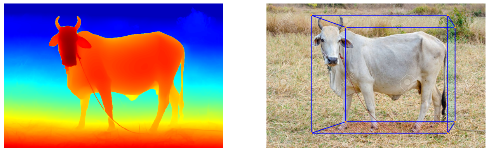
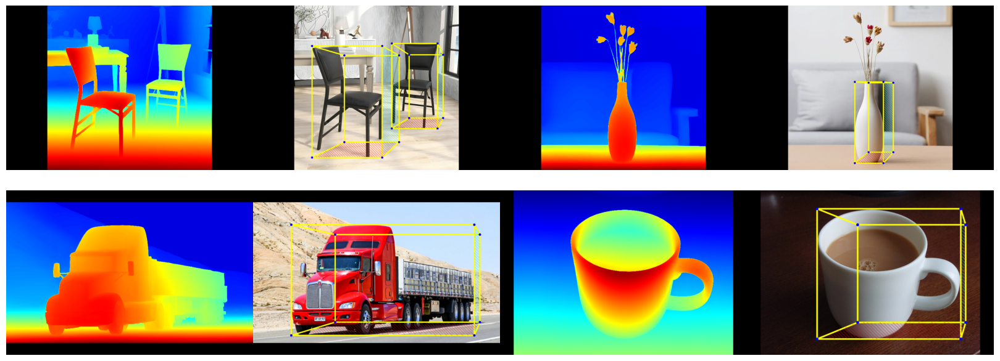

# 3D Object Detection using DepthAnythingV2 in Hugging Face

## 🧊 Monocular 3D Object Detection

## 🔳 2D Bounding Box with Depth Estimation

  
  

---

## 🏗️ Methodology

- 🔳 Object Detection Model: **PekingU/rtdetr_r50vd_coco_o365**
- 🔳 Framework: **PyTorch + Hugging Face**
- 🔳 Depth Estimation Model: **Depth-Anything-V2-Small-hf**
- 🔳 Framework: **Hugging Face**

---

## ⭐ Acknowledgements

- RTDetr powered by `Hugging Face`
- DepthAnythingV2 powered by `Hugging Face`

---
